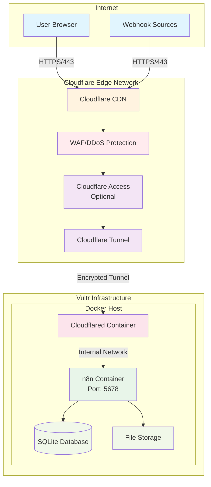

# 🚀 Production n8n Deployment with Cloudflare Zero Trust

> **production(ish)-grade workflow automation using Vultr infrastructure and Cloudflare's global network**

[](https://github.com)
[](https://vultr.com)
[](https://cloudflare.com)
[](https://community.n8n.io)

## 📁 Repository Structure

```
n8n/
├── docker-compose.yml    # Docker services configuration
├── setup.sh             # Automated installation script
├── .env                 # Environment variables (created by setup)
├── .gitignore          # Git ignore rules
├── README.md           # This file
├── files/              # n8n file storage (created by setup)
├── backups/            # Backup storage (created by setup)
└── logs/               # Application logs (created by setup)
```

> **Note**: n8n data (workflows, credentials, executions) is stored in a Docker named volume `n8n_data` for better security and performance.

## 📋 Table of Contents

- [**Quick Start** (5 minutes)](#-quick-start-for-experienced-users)
- [**Complete Tutorial**](#-complete-deployment-guide)
  - [Prerequisites & Costs](#prerequisites--costs)
  - [Architecture Overview](#architecture-overview)
  - [Step-by-Step Deployment](#step-by-step-deployment)
  - [Security & Operations](#security--operations)
  - [Troubleshooting](#troubleshooting-guide)
- [**Support & Resources**](#-support--resources)

---

## ⚡ Quick Start for Experienced Users

> **Prerequisites**: Vultr account, Cloudflare account with domain, SSH key pair

### 1️⃣ Deploy Vultr Server (2 min)
```bash
# Ubuntu 24.04 LTS, 2GB RAM minimum, add your SSH key
# Record the IP: YOUR_SERVER_IP
```

### 2️⃣ Create Cloudflare Tunnel (3 min)
1. Visit [Cloudflare Zero Trust](https://one.dash.cloudflare.com/)
2. Access → Tunnels → Create tunnel
3. Name: `n8n-production` → Docker → Copy token
4. Add public hostname: `n8n.yourdomain.com` → `http://n8n:5678`

### 3️⃣ Run Setup (3 min)
```bash
ssh root@YOUR_SERVER_IP
git clone https://github.com/DMDuFresne/n8n.git
cd n8n
chmod +x setup.sh
./setup.sh
# Paste tunnel token when prompted
# Enter your domain when prompted
```

### 4️⃣ Launch (1 min)
```bash
docker-compose up -d
# Access: https://n8n.yourdomain.com
# Create your admin account on first access
```

**Done!** Your n8n is live with professional security. 🎉

---

## 📚 Complete Deployment Guide

## Prerequisites & Costs

### 💰 Estimated Monthly Costs

| Service | Tier | Monthly Cost | Notes |
|---------|------|--------------|-------|
| **Vultr VPS** | 2GB RAM | $12 | Minimum recommended |
| **Database** | SQLite | $0 | Perfect for small businesses (2-10 users, handles hundreds of workflows) |
| **Vultr VPS** | 4GB RAM | $24 | Production recommended |
| **Cloudflare** | Free | $0 | Sufficient for most use cases |
| **Domain** | Varies | $1-2 | If purchasing new |
| **Total** | - | **$12-26** | Excluding domain |

### ✅ Pre-Deployment Checklist

- [ ] **Vultr Account** - [Sign up](https://www.vultr.com/) with $100 credit
- [ ] **Cloudflare Account** - [Free tier](https://dash.cloudflare.com/sign-up)
- [ ] **Domain Name** - Must use Cloudflare DNS
- [ ] **SSH Client** - Terminal (Mac/Linux) or [PuTTY](https://putty.org/) (Windows)
- [ ] **Password Manager** - To store generated credentials
- [ ] **30-90 minutes** - For initial deployment

### 🖥️ Recommended Server Specifications

| Component | Minimum | Recommended | Production |
|-----------|---------|-------------|------------|
| **CPU** | 1 vCPU | 2 vCPU | 4 vCPU |
| **RAM** | 2GB | 4GB | 8GB |
| **Storage** | 25GB SSD | 50GB SSD | 100GB SSD |
| **Network** | IPv4 | IPv4 | IPv4 + IPv6 |
| **OS** | Ubuntu 24.04 | Ubuntu 24.04 | Ubuntu 24.04 |

## Architecture Overview

### 🏗️ System Architecture



### 🔒 Security Model

**Security Model:** SSH-only access through Vultr. No exposed ports. Simple and secure.

```
┌──────────────────────────────────────────────────────────┐
│                   Security Layers                         │
├──────────────────────────────────────────────────────────┤
│ Layer 1: Cloudflare Edge (DDoS, WAF, Bot Protection)     │
│ Layer 2: Zero Trust Tunnel (No exposed ports)            │
│ Layer 3: Cloudflare Access (Optional MFA/SSO)            │
│ Layer 4: Container Isolation (Docker networks)           │
│ Layer 5: n8n Authentication (User accounts)              │
│ Layer 6: Data Encryption (AES-256 at rest)              │
└──────────────────────────────────────────────────────────┘
```

## Step-by-Step Deployment

### 📝 Phase 1: SSH Key Generation
**Time: 2 minutes**

<details>
<summary><b>🔑 Generate SSH Key Pair</b> (Click to expand)</summary>

#### macOS/Linux:
```bash
# Generate key
ssh-keygen -t ed25519 -C "n8n-admin@yourdomain.com" -f ~/.ssh/n8n_vultr

# Display public key (copy this)
cat ~/.ssh/n8n_vultr.pub
```

#### Windows (PowerShell):
```powershell
# Generate key
ssh-keygen -t ed25519 -C "n8n-admin@yourdomain.com" -f $HOME\.ssh\n8n_vultr

# Display public key (copy this)
type $HOME\.ssh\n8n_vultr.pub
```

#### Windows (PuTTY):
1. Open PuTTYgen
2. Click "Generate" and move mouse
3. Save private key as `n8n_vultr.ppk`
4. Copy public key from window

**Expected Output:**
```
ssh-ed25519 AAAAC3NzaC1lZDI1NTE5AAAAI... n8n-admin@yourdomain.com
```

</details>

### 🖥️ Phase 2: Vultr Server Deployment
**Time: 3 minutes**

<details>
<summary><b>🚀 Deploy Vultr Instance</b> (Click to expand)</summary>

#### Step 1: Add SSH Key to Vultr
1. Login to [Vultr Dashboard](https://my.vultr.com/)
2. Navigate to **Account → SSH Keys**
3. Click **Add SSH Key**
4. Paste your public key
5. Name: `n8n-production-key`
6. Click **Add SSH Key**

#### Step 2: Deploy Server
1. Click **Deploy New Server** (Blue + button)
2. Configure:

| Setting | Value | Why? |
|---------|-------|------|
| **Type** | Cloud Compute - Shared CPU | Cost-effective |
| **Location** | Choose nearest to you | Lower latency |
| **Image** | Ubuntu 24.04 LTS x64 | Latest stable |
| **Plan** | 55 GB SSD, 2GB RAM ($12/mo) | Minimum viable |
| **Auto Backups** | Enable ($2.40/mo) | Peace of mind |
| **SSH Keys** | Select your key | Secure access |
| **Hostname** | n8n-production | Easy identification |

3. Click **Deploy Now**
4. Wait ~60 seconds for provisioning
5. Copy the **IPv4 address** when ready

**Verification:**
```bash
# Test connection (replace with your IP)
ssh -i ~/.ssh/n8n_vultr root@YOUR_SERVER_IP
```

</details>

### ☁️ Phase 3: Cloudflare Configuration
**Time: 5 minutes**

<details>
<summary><b>🌐 Setup Cloudflare Tunnel</b> (Click to expand)</summary>

#### Step 1: Create Tunnel

1. Navigate to [Cloudflare Zero Trust](https://one.dash.cloudflare.com/)
2. Select **Access → Tunnels**
3. Click **Create a tunnel**
4. Configure:
   - **Tunnel name**: `n8n-production`
   - Click **Save tunnel**

#### Step 2: Get Connection Token

1. Select **Docker** as environment
2. **Copy the entire token** (starts with `eyJ...`)
3. **Save this token** - you'll need it in the setup script

#### Step 3: Configure Public Hostname

1. Select your tunnel → **Public Hostname** tab
2. Click **Add a public hostname**
3. Configure:

| Field | Value |
|-------|-------|
| **Subdomain** | `n8n` |
| **Domain** | Select your domain |
| **Path** | Leave empty |
| **Type** | HTTP |
| **URL** | `n8n:5678` |

4. Click **Save hostname**

> 💡 **Important**: Keep the tunnel token handy for the next phase!

#### Step 4: Configure Cloudflare Access (Optional - Enhanced Security)

<details>
<summary><b>🔐 Add Extra Authentication Layer</b> (Click to expand)</summary>

This adds an additional authentication layer before users reach n8n's login page.

1. Navigate to **Access → Applications**
2. Click **Add an application**
3. Select **Self-hosted**
4. Configure Application:
   - **Application name**: `n8n Production`
   - **Session Duration**: 24 hours
   - **Application domain**: `n8n.yourdomain.com`
   - Click **Next**

5. Configure Identity Providers:
   - Enable desired providers:
     - **One-time PIN** (Email-based)
     - **Google** (OAuth)
     - **GitHub** (OAuth)
     - **Microsoft** (Azure AD)
   - Click **Next**

6. Create Access Policy:
   - **Policy name**: `Authorized Users`
   - **Action**: Allow
   - Configure rules (choose one):
     - **Email ending in**: `@yourcompany.com`
     - **Email list**: Add specific emails
     - **IP ranges**: Add your office IPs
     - **Country**: Restrict by geography
   - Click **Next**

7. Additional Settings:
   - **Enable automatic CORS headers**: Yes
   - **Browser rendering**: Disabled
   - **Options**: Enable "Skip identity provider selection"
   - Click **Add application**

**Benefits of Cloudflare Access:**
- ✅ Multi-factor authentication (MFA)
- ✅ Single Sign-On (SSO) integration
- ✅ Audit logs of all access attempts
- ✅ Temporary access grants
- ✅ IP and country restrictions

**Note**: Users will need to authenticate twice:
1. First with Cloudflare Access
2. Then with n8n's built-in authentication

</details>

</details>

### 💻 Phase 4: Automated Setup
**Time: 5 minutes**

<details>
<summary><b>⚙️ Run Installation Script</b> (Click to expand)</summary>

#### Step 1: Connect & Clone
```bash
# Connect to server
ssh -i ~/.ssh/n8n_vultr root@YOUR_SERVER_IP

# Verify system
lsb_release -a
# Expected: Ubuntu 24.04 LTS

# Clone repository
git clone https://github.com/DMDuFresne/n8n.git
cd n8n

# Make scripts executable
chmod +x setup.sh
```

#### Step 2: Run Setup Script
```bash
./setup.sh
```

The script will automatically perform these tasks:
- ✅ Install prerequisites (curl, wget, gnupg, etc.)
- ✅ Install Docker & Docker Compose
- ✅ Create 2GB swap space
- ✅ Configure kernel security optimizations
- ✅ Set up firewall rules (or detect Vultr cloud firewall)
- ✅ Generate encryption key for data security
- ✅ Create required directories (files, backups, logs)
- ✅ Configure health monitoring (auto-restart on crash)

**Interactive Configuration Prompts:**

#### Prompt 1: Cloudflare Tunnel Token
```
════════════════════════════════════════════
  Cloudflare Tunnel Configuration
════════════════════════════════════════════

Please have your Cloudflare Tunnel token ready.
Steps to get token:
1. Go to: https://one.dash.cloudflare.com/
2. Navigate to: Access → Tunnels
3. Create tunnel named: n8n-production
4. Choose: Docker environment
5. Copy the token (starts with eyJ)

Enter Cloudflare Tunnel token (or press Enter to skip): 
```
> 💡 **Action**: Paste your tunnel token from Phase 3, or press Enter to add it manually later

#### Prompt 2: Domain Configuration
```
════════════════════════════════════════════
  Domain Configuration
════════════════════════════════════════════

Enter your domain (e.g., n8n.example.com): 
```
> 💡 **Action**: Enter your domain (e.g., `n8n.yourdomain.com`)

#### Prompt 3: Timezone Configuration
```
════════════════════════════════════════════
  Timezone Configuration (Optional)
════════════════════════════════════════════

Current timezone: America/New_York
Change timezone? (y/N): 
```
> 💡 **Action**: Press `N` to keep default, or `Y` to change

If you choose to change timezone:
```
Common timezones:
  1) America/New_York
  2) America/Chicago
  3) America/Los_Angeles
  4) Europe/London
  5) Europe/Paris
  6) Asia/Tokyo
  7) Australia/Sydney
  8) Enter custom

Select option (1-8): 
```
> 💡 **Action**: Enter number 1-7 for preset, or 8 to enter custom timezone

**What the script configures automatically:**
- **N8N_ENCRYPTION_KEY**: Auto-generated secure 32-byte key
- **Memory limits**: 2GB container limit with swap
- **Cleanup settings**: Auto-prune executions older than 7 days
- **Concurrency**: Limited to 10 parallel executions
- **Health checks**: Every 5 minutes via cron
- **Log rotation**: 14-day retention
- **Kernel parameters**: Optimized for Docker performance

**Success Output:**
```
━━━━━━━━━━━━━━━━━━━━━━━━━━━━
       ✅ SETUP COMPLETE!
━━━━━━━━━━━━━━━━━━━━━━━━━━━━

📋 Configuration Summary:
━━━━━━━━━━━━━━━━━━━━━━━━━━━━
Domain:        n8n.yourdomain.com
Timezone:      America/New_York
Tunnel Token:  Configured
Infrastructure: Vultr VPS
SSH Access:    Managed by Vultr
Firewall:      Vultr Cloud Firewall
━━━━━━━━━━━━━━━━━━━━━━━━━━━━
```

#### Step 3: Start Services

If you provided the tunnel token during setup:
```bash
# Launch containers immediately
docker-compose up -d

# Verify containers are running
docker ps
# Expected: 2 containers (n8n, cloudflared)

# Check tunnel connection
docker logs cloudflared | grep "Connection"
# Expected: "Connection registered"
```

If you skipped the tunnel token:
```bash
# First, add your token to the .env file
nano .env
# Find: TUNNEL_TOKEN=YOUR_TUNNEL_TOKEN
# Replace with: TUNNEL_TOKEN=eyJ... (your actual token)
# Save: Ctrl+X, Y, Enter

# Then launch containers
docker-compose up -d
```

</details>

### ✅ Phase 5: Validation & Access
**Time: 2 minutes**

<details>
<summary><b>🎯 Verify Deployment</b> (Click to expand)</summary>

#### Step 1: Test Access

1. Open browser to: `https://n8n.yourdomain.com`
2. You should see the **n8n setup screen** (or Cloudflare Access login if configured)
3. Create your owner account:
   - Enter your email address
   - Choose a strong password
   - Enter your name
4. Click **Next** to complete setup
5. Success = n8n dashboard appears!

> 💡 **First User = Admin**: The first account created becomes the instance owner with full admin privileges

#### Step 2: System Health Checks

```bash
# Container status
docker-compose ps
# Expected: Both containers "Up"

# Memory usage
free -h
# Expected: Swap enabled, memory available

# Disk usage
df -h /
# Expected: <80% used

# Recent logs
docker-compose logs --tail=50
# Expected: No errors

# Health monitoring status
tail -20 /var/log/n8n-health.log
# Expected: No warnings
```

#### Step 3: Create Test Workflow

1. In n8n, click **New Workflow**
2. Add a **Schedule Trigger** node
3. Add a **Set** node
4. Connect them
5. Click **Execute Workflow**
6. Success = Workflow runs!

**🎉 Congratulations! Your n8n is production-ready!**

</details>

## Security & Operations

### 🔐 Security Hardening

<details>
<summary><b>Advanced Security Configuration</b> (Click to expand)</summary>

#### Enable Cloudflare WAF Rules

> **⚠️ CRITICAL**: Without rate limiting, your workflows are vulnerable to DoS attacks via webhook spam.

1. **Cloudflare Dashboard → Security → WAF → Custom Rules**
2. **Create these essential rules:**

```yaml
Rule 1: Webhook Rate Limiting (HIGH PRIORITY)
  Field: URI Path
  Operator: contains
  Value: /webhook/
  Rate: 100 requests per minute per IP
  Action: Challenge
  
Rule 2: Login Protection  
  Field: URI Path
  Operator: equals
  Value: /rest/login
  Rate: 5 requests per minute per IP
  Action: Block for 10 minutes

Rule 3: API Endpoint Protection
  Field: URI Path
  Operator: starts with
  Value: /rest/
  Rate: 200 requests per minute per IP
  Action: Challenge

Rule 4: Geographic Restrictions (Optional)
  Field: Country
  Operator: not in
  Value: [Your allowed countries]
  AND Field: URI Path
  Operator: starts with  
  Value: /rest/
  Action: Block
```

3. **Additional WAF Security Rules:**

```yaml
Rule 5: Block Common Attack Patterns
  Field: URI
  Operator: contains any
  Values: [../../../, <script>, SELECT * FROM, DROP TABLE]
  Action: Block

Rule 6: User Agent Filtering
  Field: User Agent  
  Operator: does not contain
  Value: Mozilla
  AND Field: URI Path
  Operator: starts with
  Value: /webhook/
  Action: Challenge (blocks most bots, allows legitimate webhooks)
```

4. **Enable Bot Fight Mode:**
   - Dashboard → Security → Bots → Configure
   - Turn ON "Bot Fight Mode" 
   - Add `/webhook/*` to "Allowed Paths" if legitimate services get blocked

#### 🔐 Secure Token Management

**Environment File Protection**

```bash
# .env file permissions are already secured by the setup script
# The file has 600 permissions (read/write for owner only)
chmod 600 .env
chown root:root .env
```

#### Server Hardening

```bash
# Disable root SSH (after creating admin user)
adduser n8nadmin
usermod -aG sudo n8nadmin
usermod -aG docker n8nadmin

# Copy SSH key
mkdir /home/n8nadmin/.ssh
cp ~/.ssh/authorized_keys /home/n8nadmin/.ssh/
chown -R n8nadmin:n8nadmin /home/n8nadmin/.ssh

# Disable root login
sed -i 's/PermitRootLogin yes/PermitRootLogin no/' /etc/ssh/sshd_config
systemctl restart sshd
```

#### Enable Audit Logging

```bash
# Install auditd
apt install auditd

# Monitor n8n files
auditctl -w /root/n8n/data -p wa -k n8n_data
auditctl -w /root/n8n/.env -p wa -k n8n_config

# View audit logs
ausearch -k n8n_data
```

</details>

### 📊 Monitoring & Maintenance

<details>
<summary><b>Production Monitoring Setup</b> (Click to expand)</summary>

#### Health Monitoring Script (Auto-configured)

The setup script automatically installs health monitoring that:
- Checks every 5 minutes via cron
- Auto-restarts crashed containers
- Monitors disk space (warns at 85%)
- Monitors memory (warns at <200MB free)
- Logs to `/var/log/n8n-health.log`

View health status:
```bash
tail -f /var/log/n8n-health.log
```

#### Manual Health Check
```bash
/usr/local/bin/n8n-health-check.sh
```

#### Uptime Monitoring Services

1. **UptimeRobot** (Free tier: 50 monitors)
   - Add monitor: `https://n8n.yourdomain.com/healthz`
   - Check interval: 5 minutes
   - Alert contacts: Email, Slack, SMS

2. **Cloudflare Analytics**
   - Built-in with Zero Trust
   - View: Analytics → Web Analytics
   - Monitor: Request count, error rate, performance

#### Log Management

```bash
# View real-time logs
docker-compose logs -f

# View n8n logs only
docker logs n8n --tail 100

# View tunnel logs
docker logs cloudflared --tail 100

# Search for errors
docker logs n8n 2>&1 | grep -i error | tail -20
```

</details>

## Troubleshooting Guide

### 🔧 Common Issues & Solutions

<details>
<summary><b>Problem: Cannot Access n8n</b> (Click to expand)</summary>

**Symptom:** Browser shows error when accessing n8n URL

**Diagnosis & Solutions:**

```bash
# 1. Check container status
docker ps -a
# If not running: docker-compose up -d

# 2. Check tunnel connection
docker logs cloudflared --tail 50 | grep -i error
# If errors: Verify tunnel token in .env

# 3. Check n8n logs
docker logs n8n --tail 50
# Look for startup errors

# 4. Verify DNS resolution
nslookup n8n.yourdomain.com
# Should resolve to Cloudflare IPs

# 5. Test local connectivity
curl http://localhost:5678/healthz
# Should return {"status":"ok"}

# 6. Check Cloudflare Tunnel dashboard
# Ensure tunnel shows as "Healthy"

# 7. Full restart
docker-compose down
docker-compose up -d
```

</details>

<details>
<summary><b>Problem: High Memory Usage</b> (Click to expand)</summary>

**Symptom:** n8n becomes slow or unresponsive

**Solutions:**

```bash
# 1. Check current usage
docker stats --no-stream
free -h

# 2. Increase container memory limit
# Edit docker-compose.yml:
deploy:
  resources:
    limits:
      memory: 4G  # Increase from 2G

# 3. Add more swap
swapoff /swapfile
rm /swapfile
fallocate -l 4G /swapfile
chmod 600 /swapfile
mkswap /swapfile
swapon /swapfile

# 4. Restart with new limits
docker-compose down
docker-compose up -d

# 5. Clean up Docker
docker system prune -a --volumes
```

</details>

<details>
<summary><b>Problem: Workflows Not Executing</b> (Click to expand)</summary>

**Symptom:** Workflows fail or don't trigger

**Solutions:**

```bash
# 1. Check webhook URL
docker exec n8n printenv | grep WEBHOOK_URL
# Should be https://n8n.yourdomain.com

# 2. Test webhook
curl -X POST https://n8n.yourdomain.com/webhook/test \
     -H "Content-Type: application/json" \
     -d '{"test": "data"}'

# 3. Check timezone
docker exec n8n date
# If wrong: Update TIMEZONE in .env and restart

# 4. Database integrity check (inside container)
docker exec n8n sh -c "cd /home/node/.n8n && sqlite3 database.sqlite 'PRAGMA integrity_check;'"
# Should return "ok"

# 5. Check execution mode
docker exec n8n printenv | grep EXECUTIONS_MODE
# Should not be set (defaults to regular mode)
```

</details>

<details>
<summary><b>Problem: Lost Password</b> (Click to expand)</summary>

**Password Recovery Procedure:**

```bash
# Option 1: Reset via database (if you're the only user)
docker-compose stop n8n

# Access database inside the volume
docker run --rm -it -v n8n_n8n_data:/data alpine sh
cd /data
apk add sqlite
sqlite3 database.sqlite

# In SQLite prompt:
DELETE FROM user;
DELETE FROM credentials_entity WHERE type = 'n8nApp';
.quit

# Exit container and restart n8n
exit
docker-compose start n8n
# Now visit the URL and create a new owner account

# Option 2: Use n8n CLI to create new owner (advanced)
docker exec -it n8n n8n user-management:reset
```

> **Note**: After reset, visit your n8n URL to create a new owner account

</details>

### 🔍 Advanced Diagnostics

<details>
<summary><b>Run Complete System Diagnostic</b> (Click to expand)</summary>

```bash
# Create diagnostic script
cat > diagnose.sh << 'EOF'
#!/bin/bash

echo "=== n8n Diagnostic Report ==="
echo "Date: $(date)"
echo ""

echo "=== System Info ==="
uname -a
lsb_release -a
echo ""

echo "=== Resource Usage ==="
free -h
df -h
echo ""

echo "=== Docker Status ==="
docker version
docker ps -a
docker stats --no-stream
echo ""

echo "=== Container Logs (last 20 lines) ==="
echo "--- n8n ---"
docker logs n8n --tail 20
echo "--- cloudflared ---"
docker logs cloudflared --tail 20
echo ""

echo "=== Network Tests ==="
ping -c 4 1.1.1.1
curl -I https://n8n.yourdomain.com
echo ""

echo "=== Database Stats ==="
echo "Database size:"
docker exec n8n sh -c "du -h /home/node/.n8n/database.sqlite"
echo "Workflow count:"
docker exec n8n sh -c "cd /home/node/.n8n && sqlite3 database.sqlite 'SELECT COUNT(*) as workflows FROM workflow_entity;'"
echo "Execution count:"
docker exec n8n sh -c "cd /home/node/.n8n && sqlite3 database.sqlite 'SELECT COUNT(*) as executions FROM execution_entity;'"
echo ""

echo "=== Recent Errors ==="
docker logs n8n 2>&1 | grep -i error | tail -10
echo ""

echo "=== Cron Jobs ==="
crontab -l
echo ""

echo "=== Volume Information ==="
docker volume ls
docker volume inspect n8n_n8n_data | grep -A 2 "Mountpoint"
echo ""

echo "=== End Report ==="
EOF

chmod +x diagnose.sh

# Run diagnostics
./diagnose.sh > diagnostic-report-$(date +%Y%m%d-%H%M%S).txt
```

</details>

## 📖 Support & Resources

### Documentation
- 📚 [n8n Official Docs](https://docs.n8n.io/)
- 🔐 [Cloudflare Tunnel Guide](https://developers.cloudflare.com/cloudflare-one/connections/connect-apps/)
- 🐳 [Docker Best Practices](https://docs.docker.com/develop/dev-best-practices/)

### Community Support
- 💬 [n8n Community Forum](https://community.n8n.io/)
- 💭 [n8n Discord Server](https://discord.gg/n8n)
- 🐛 [GitHub Issues](https://github.com/n8n-io/n8n/issues)

### Professional Support
- 🏢 [n8n Enterprise](https://n8n.io/enterprise/)
- ☁️ [n8n Cloud](https://n8n.io/cloud/)
- 📧 [Contact Sales](https://n8n.io/contact/)

### Quick Command Reference

```bash
# === Service Management ===
docker-compose up -d                  # Start all services
docker-compose down                   # Stop all services
docker-compose restart                # Restart all services
docker-compose logs -f                # Stream logs
docker ps                             # List containers

# === Backup & Recovery ===
# Create backup manually when needed:
docker run --rm -v n8n_n8n_data:/data -v $(pwd)/backups:/backup alpine tar czf /backup/n8n-data-backup.tar.gz -C /data .

# === Monitoring ===
docker stats                         # Resource usage
docker logs n8n --tail 100          # Recent n8n logs
df -h                               # Disk usage
free -h                             # Memory usage
tail -f /var/log/n8n-health.log    # Health monitoring

# === Updates ===
docker-compose pull                  # Get latest images
docker-compose up -d                 # Apply updates

# === Troubleshooting ===
./diagnose.sh                       # Run diagnostics
docker exec -it n8n sh              # Container shell
docker exec n8n sh -c "cd /home/node/.n8n && sqlite3 database.sqlite"  # Database access
docker volume inspect n8n_n8n_data  # Volume details
```

### Environment Variables Reference

| Variable | Description | Default |
|----------|-------------|---------|
| `DOMAIN` | Public hostname | Required |
| `N8N_ENCRYPTION_KEY` | Data encryption | Auto-generated |
| `TUNNEL_TOKEN` | Cloudflare tunnel | Required |
| `TIMEZONE` | System timezone | America/New_York |
| `EXECUTIONS_DATA_PRUNE` | Auto-cleanup | true |
| `EXECUTIONS_DATA_MAX_AGE` | Keep days | 168 |
| `N8N_CONCURRENCY_LIMIT` | Max parallel | 10 |
| `NODE_OPTIONS` | Node.js memory | 2048MB |

---

## ⚖️ License & Legal

### Disclaimer

**NO WARRANTY**: This deployment guide is provided "AS IS" without warranty of any kind, express or implied.

**USER RESPONSIBILITY**: You are solely responsible for:
- Security of your deployment
- Compliance with regulations
- Backup and disaster recovery
- Monitoring and maintenance
- Associated costs

**NOT OFFICIAL**: This is a community contribution, not officially affiliated with or endorsed by:
- n8n.io GmbH
- Cloudflare, Inc.
- Vultr Holdings Corporation

### Compliance Checklist

- [ ] GDPR compliance if handling EU data
- [ ] CCPA compliance if handling California resident data
- [ ] HIPAA compliance if handling health data
- [ ] PCI DSS if handling payment cards
- [ ] SOC 2 for enterprise requirements

### Cost Management

Monitor and control costs:
- Set Vultr spending limits
- Monitor bandwidth usage
- Use Cloudflare Analytics
- Regular backup cleanup
- Optimize container resources

---

## Updating n8n

To update to a new n8n version:
1. Edit docker-compose.yml, change version number
2. Run: `docker-compose pull`
3. Run: `docker-compose down`
4. Run: `docker-compose up -d`

## 🔄 Version History

- **v1.0** (2024) - Initial release
  - Vultr VPS optimized deployment
  - Cloudflare Zero Trust integration
  - Docker volume-based storage
  - Manual backup command reference
  - Health monitoring

## 🤝 Contributing

Contributions are welcome! Please:
1. Fork the repository
2. Create a feature branch
3. Test thoroughly on Ubuntu 24.04 LTS
4. Submit a pull request

## 📝 Credits

Created with ❤️. Not officially affiliated with n8n.io GmbH, Cloudflare Inc., or Vultr Holdings Corporation.

---

**Last Updated**: 2025 | **License**: MIT | **Status**: Ready